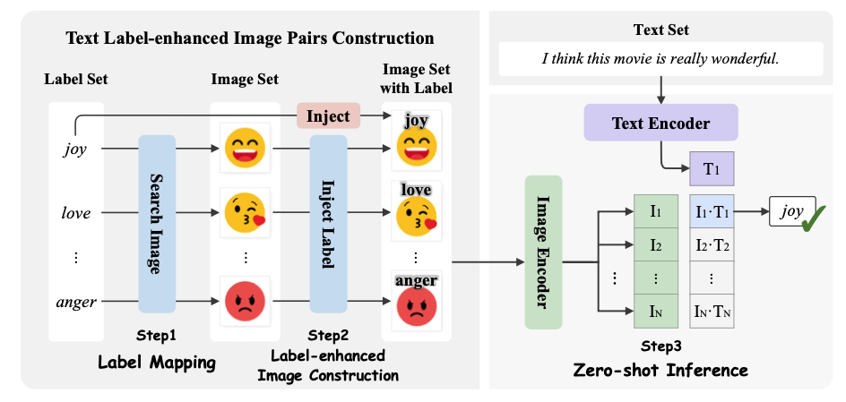
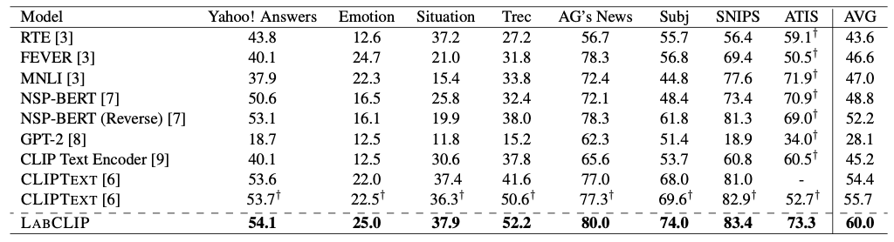

<!--
 * @Author: Peng Wang
 * 
-->
# LABCLIP


This code has been written using PyTorch >= 2.0. If you find this code useful for your research, please consider citing the following paper:

## Prerequisites

This codebase was developed and tested with the following settings:

```
-- scikit-learn==1.2.1
-- numpy==1.24.2
-- pytorch==2.0.1
-- torchvision==0.15.2
-- tqdm==4.64.1
-- clip==1.0
-- transformers==4.27.1
-- regex==2022.10.31
-- ftfy==6.1.1
-- pillow==9.4.0
```

* Please Attention: Different version of clip might lead to different results, we hope that you can install clip by this command:

```shell
pip install git+https://github.com/openai/CLIP.git@a9b1bf5
```

## How to run it

The script **main.py** acts as a main function to the project, you can run the experiments by the following commands:


```shell
python main.py --test --dataset [dataset_name]
```


where  `[dataset_name]` in `['emotion', 'situation', 'topic', 'agnews', 'snips', 'trec', 'subj', 'atis']`

## Network Architecture



## Model Performance

<div>

</div>

